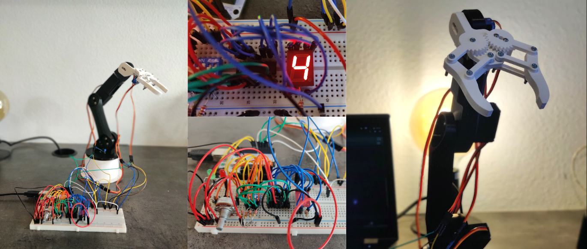
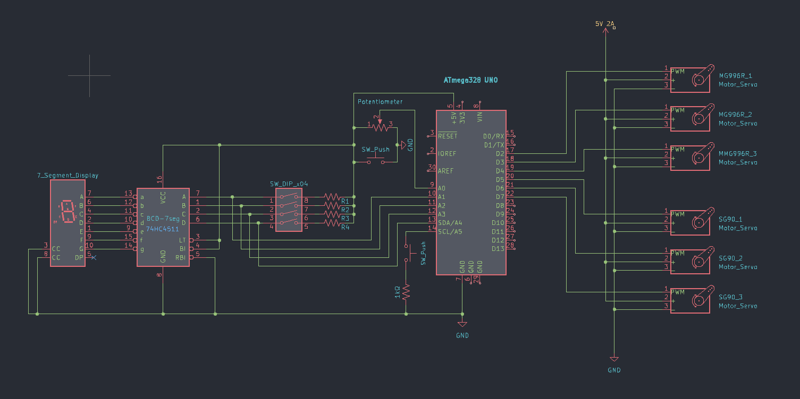

# PinchBot - Your Robotic Gripping Companion  
Arduino source code for my final project for the Electronic Systems (ELSY) class at KU Leuven Diepenbeek & UHasselt.  
  

All details at [www.simonwilmots.com/project/pinchbot](https://www.simonwilmots.com/project/pinchbot)

## Robot Arm Model
The model of the robotic arm is created and designed by How To Mechatronics and can be viewed and downloaded on [Thangs.com](https://thangs.com/designer/HowToMechatronics/3d-model/Robotic%20Arm%203D%20Model-38899).

## Electronics & Circuit Diagram
All the electronics I used and discussed on [my website](https://www.simonwilmots.com/project/pinchbot) are: DIP switch, Potentiometer, Button, LEDs, 7-seg display, BCD/7seg IC, Servos.

Below you can find the KiCad schematic of the whole project.
 

## License
PinchBot is released under the **<u>[MIT License](https://opensource.org/licenses/MIT)</u>**. 